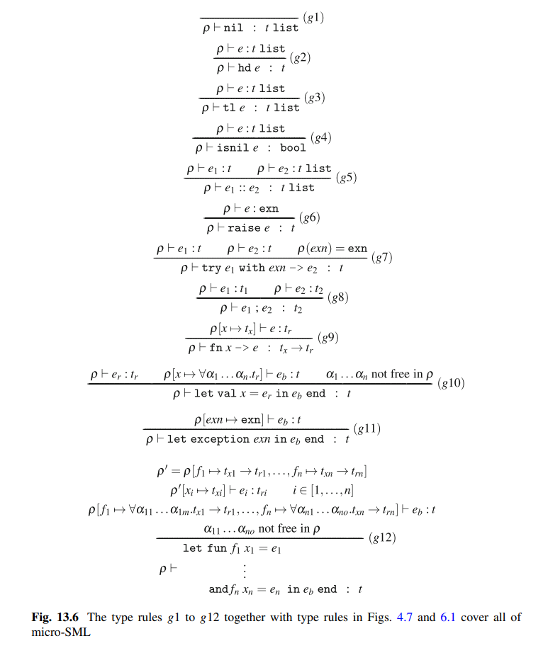
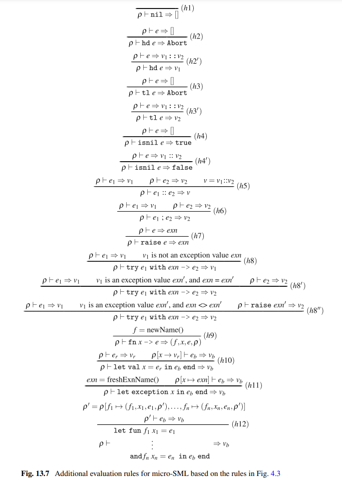

# Programs as Data - Assignment 12

Non-code answers to the exercises are answered in this document!

Assignments are from Programming Language Concepts (PLC), by Peter Sestoft, Springer 2017.

---

</br>

## PLC 13.1

Download `microsml.zip` from the book homepage, unpack it to a folder `Sml`, and build the micro-SML compiler as explained in `README.TXT` step A to C.

Compile the micro-SML example `ex09.sml` with all options, `-opt`, `-verbose` and `-eval`, enabled. This provides the following result:

* A file `ex09.out` being the byte code for file `ex09.sml`
* A lot of output on the console, including abstract syntax with tail call and type information, the result of evaluating the program and the assembly byte code

Now execute `ex09.out` with the bytecode machine, by running `msmlmachine ex09.out`. The result will be written to the console.

> **Answer:** See output of compiling `ex09.sml` using `microsml.exe -opt -verbose -eval ex09.sml` and running `ex09.out` with `msmlmachine ex09.out` below

```txt
./microsmlc.exe -opt -verbose -eval ./MicroSML/examples/ex09.sml
Micro-SML compiler v 1.1 of 2018-11-18
Compiling ./MicroSML/examples/ex09.sml to ./MicroSML/examples/ex09.out

Program after alpha conversion (exercise):
fun f x = if (x < 0) then g 4 else f (x - 1)
and g x = x
begin
  print(f 2)
end
Program with tailcalls:
fun f x = if (x < 0) then g_tail 4 else f_tail (x - 1)
and g x = x
begin
  print(f 2)
end
Program with types:
fun f x = if (x:int < 0:int):bool then g:(int -> int)_tail 4:int:int else f:(int -> int)_tail (x:int - 1:int):int:int
and g x = x:int
begin
  print(f:(int -> int) 2:int:int):int
end
Result type: int

Evaluating Program
4 
Result value: Result (Int 4)
Used: Elapsed 83ms, CPU 78ms
Compiled to ./MicroSML/examples/ex09.out
LABEL G_ExnVar_L2
     0: CSTI 0
     2: CSTI 0
     4: STI
LABEL G_Valdecs_L3
     5: ACLOS 1
     7: ACLOS 1
     9: PUSHLAB LabFunc_f_L4
    11: CSTI 1
    13: LDI
    14: HEAPSTI 1
    16: INCSP -1
    18: PUSHLAB LabFunc_g_L5
    20: CSTI 2
    22: LDI
    23: HEAPSTI 1
    25: INCSP -1
    27: GETSP
    28: CSTI 2
    30: SUB
    31: CALL 0 L1
    34: STI
    35: INCSP -3
    37: STOP
LABEL LabFunc_f_L4
    38: GETBP
    39: CSTI 1
    41: ADD
    42: LDI
    43: CSTI 0
    45: LT
    46: IFZERO L6
    48: CSTI 2
    50: LDI
    51: CSTI 4
    53: TCLOSCALL 1
LABEL L6
    55: GETBP
    56: LDI
    57: GETBP
    58: CSTI 1
    60: ADD
    61: LDI
    62: CSTI 1
    64: SUB
    65: TCLOSCALL 1
LABEL LabFunc_g_L5
    67: GETBP
    68: CSTI 1
    70: ADD
    71: LDI
    72: RET 2
LABEL L1
    74: CSTI 1
    76: LDI
    77: CSTI 2
    79: CLOSCALL 1
    81: PRINTI
    82: RET 0
```

Running `ex09.out` with `msmlmachine`:

```txt
./msmlmachine MicroSML/examples/ex09.out
4 
Result value: 4
Used 0 cpu milli-seconds
```

Using the information above, answer the following:

1. What is the result value of running `ex09.out`?
2. What type does the result value have? (Look at the result produced by the interpreter).
3. What application calls have been annotated as tail calls? Explain how this matches the intuition behind a tail call.
4. What type has been annotated for the call sites to the functions `f` and `g`? Function `f` is called in two places, and `g` in one place.
5. What is the running time for executing the example using the evaluator, and what is the running time using the byte code `ex09.out` using `msmlmachine`?
6. Now compile the example `ex09.sml` without optimizations. How many byte code instructions did the optimization save for this small example?

> **Answer:**
>
> 1\. The result value is "4".
>
> </br>
>
> 2\. Result type is type int.
>
> </br>
>
> 3\. Function `f` and `g` has ben annotated as tail calls in:

```txt
fun f x = if (x < 0) then g_tail 4 else f_tail (x - 1)
and g x = x
begin
    print(f 2)
end
```

> It matches the intuition behind a tail call in the way that if we have an if-statement of the form $\text{if } e_{1} \text{ then } e_{2} \text{ else } e_{3}$ then $e_{2}$ and $e_{3}$ is in a possible tail-call position.
>
> In this case we call mutual recursive functions, which are in tail positions of `f`.
>
> </br>
>
> 4\. The call `g 4` has type int, `f (x - 1)` in the else-case of `f` has type int, and the call `f 2` has type int.

```fsharp
g:(int -> int)_tail 4:int:int
f:(int -> int)_tail (x:int - 1:int):int:int
print(f:(int -> int) 2:int:int):int
```

> 5\. See the elapsed time below:

```txt
Compiler -eval
Used: Elapsed 83ms, CPU 78ms

msmlmachine ex09.out
Used 0 cpu milli-seconds
```

> 6\. It saved us for 5 bytecode instructions for `ex09`.

```txt
./microsmlc.exe -verbose -eval ./MicroSML/examples/ex09.sml

64 Instructions - 59 instructions =
5 instructions.
```

```txt
OUTPUT

./microsmlc.exe -verbose -eval ./MicroSML/examples/ex09.sml
Micro-SML compiler v 1.1 of 2018-11-18
Compiling ./MicroSML/examples/ex09.sml to ./MicroSML/examples/ex09.out

Program after alpha conversion (exercise):
fun f x = if (x < 0) then g 4 else f (x - 1)
and g x = x
begin
  print(f 2)
end
Program with types:
fun f x = if (x:int < 0:int):bool then g:(int -> int)_tail 4:int:int else f:(int -> int)_tail (x:int - 1:int):int:int
and g x = x:int
begin
  print(f:(int -> int) 2:int:int):int
end
Result type: int

Evaluating Program
4 
Result value: Result (Int 4)
Used: Elapsed 109ms, CPU 109ms
Compiled to ./MicroSML/examples/ex09.out
LABEL G_ExnVar_L2
     0: CSTI 0
     2: CSTI 0
     4: STI
LABEL G_Valdecs_L3
     5: ACLOS 1
     7: ACLOS 1
     9: PUSHLAB LabFunc_f_L4
    11: CSTI 1
    13: LDI
    14: HEAPSTI 1
    16: INCSP -1
    18: PUSHLAB LabFunc_g_L5
    20: CSTI 2
    22: LDI
    23: HEAPSTI 1
    25: INCSP -1
    27: GETSP
    28: CSTI 2
    30: SUB
    31: CALL 0 L1
    34: STI
    35: INCSP -3
    37: STOP
LABEL LabFunc_f_L4
    38: GETBP
    39: CSTI 1
    41: ADD
    42: LDI
    43: CSTI 0
    45: LT
    46: IFZERO L7
    48: CSTI 2
    50: LDI
    51: CSTI 4
    53: CLOSCALL 1
    55: GOTO L6
LABEL L7
    57: GETBP
    58: CSTI 0
    60: ADD
    61: LDI
    62: GETBP
    63: CSTI 1
    65: ADD
    66: LDI
    67: CSTI 1
    69: SUB
    70: CLOSCALL 1
LABEL L6
    72: RET 2
LABEL LabFunc_g_L5
    74: GETBP
    75: CSTI 1
    77: ADD
    78: LDI
    79: RET 2
LABEL L1
    81: CSTI 1
    83: LDI
    84: CSTI 2
    86: CLOSCALL 1
    88: PRINTI
    89: RET 0
```

</br>

---

</br>

## PLC 13.2

In this exercise we extend micro-SML with a pair expression `(e1, e2)`. We can create a pair, and we can access the first and second components of a pair `p` by `fst(p)` and `snd(p)`.

The example program `pair.sml` shows a use of pairs where the pair's first and second components are accessed.

```sml
val p = (1, 43)
fun f p = if fst(p) < 0 then g p else f (fst(p)-1, snd(p)) and g p = (fst(p), snd(p)-1)

begin
    print (f p)
end
```

The goal of this exercise is to implement lexing, parsing, type inference, interpretation and compilation of pairs, and then to run the program. For instance, the type annotated abstract syntax should be as follows:

```sml
Program with types:
val p = (1:int,43:int):(int * int)
fun f p =
    if (fst(p:(int * int)):int < 0:int):bool
        then g:((int * int) -> (int * int))_tail p:(int * int):(int * int)
        else f:((int * int) -> (int * int))_tail
                ((fst(p:(int * int)):int - 1:int):int,
                    snd(p:(int * int)):int):(int * int):(int * int)
and g p = (fst(p:(int * int)):int,
            (snd(p:(int * int)):int - 1:int):int):(int * int)
begin
    print(f:((int * int) -> (int * int)) p:(int * int):(int * int)):(int * int)
end
Result type: (int * int)
```

The type of `p` is `int * int`. The type of `f` is `int * int −> int * int`. The final result type is also a pair `int * int`.

Interpreting the program you get

`Result value: Result (PairV (Int -1, Int 42))`

You can use the following steps to implement support for pairs:

1. Write type rules for the primitives `fst` and `snd`, see Fig. 13.6

    

2. Write evaluation rules for the primitives `fst` and `snd`, see Fig. 13.7.

    

3. **FunLex.fsl**: Extend with token `COMMA` and unary primitives `snd` and `fst`.
4. **FunPar.fsy**: Extend with token `COMMA` and a rule for creating a pair. The concrete syntax is `(e1, e2)`.
5. **Absyn.fs**: Extend the abstract syntax with a pair expression:

    ```fsharp
    type expr<'a> =
        ...
        | Pair of expr<'a> * expr<'a> * 'a option
        ...
    ```

    Some compiler functions must also be extended to handle pair expressions: `ppProg`, `getOptExpr`, `tailcalls` and `freevars`.

6. **TypeInference.fs**: Extend the `typ` type with the new pair type:

    ```fsharp
    type typ =
        ...
        | TypP of typ * typ
    ```

    Some compiler functions must be extended: `resolveType`, `freeTypeVars`, `typeToString`, `unify`, `copyType`, `showType`, `typExpr`. Type function `typExpr` must be extended with type inference for unary primitives `fst`, `snd` and then the pair construction `Pair(e1, e2, _)` expression.

7. **HigherFun.fs**: The interpreter must be able to handle pair values:

    ```fsharp
    type value =
        ...
        | PairV of value * value
    ```

    Thus the following interpreter functions must be extended: `ppValue`, `evalExpr` and `check`.

8. **msmlmachine.c**: Two new byte code instructions are needed. One for creating a pair, `PAIR` and one for printing a pair, `PRINTP`. To simplify matters you can implement `PRINTP` assuming that pairs will always contain scalar values. This is of course not always the case.

    | Instruction     | Stack before      |               | Stack after | Effect                              |
    | --------------- | ----------------- | ------------- |------------ | ----------------------------------- |
    | **42** `Pair`   | *s*, $v_1$, $v_2$ | $\Rightarrow$ | *s*, *p*    | Create pair cell `(v1, v2)` on heap |
    | **44** `PRINTP` | *s*, *p*          | $\Rightarrow$ | *s*, *p*    | Print pair value pointed at by *p*  |

9. **ContComp.fs**: The compiler must be extended to generate code for creating a pair in the heap and for accessing the first and second component with `fst` and `snd` respectively.

    The primitives `fst` and `snd` are easily done using `CAR` and `CDR` in the bytecode. A pair is created using the new byte code instruction `PAIR`. The compiler function `cExpr` must be extended.

10. **Machine.fs**: The byte code instructions `PRINTP` and `PAIR` must be added. You have to assign unique instruction codes to `PRINTP` and `PAIR` that match with same instructions in `msmlmachine.c`.

> **Answer:** See file **pair1.sml** and **pair.sml** (for tests)
>
> 1\. Not done
>
> 2\. Not done
>
> 3\. DONE - See file **Funlex.fsl**
>
> 4\. DONE - See file **FunPar.fsy**
>
> 5\. DONE - See file **Absyn.fs**
>
> 6\. Half Done (unify? typExpr?) - See file **TypeInference.fs**
>
> 7\. DONE - See file **HigherFun.fs**
>
> 8\. DONE - See file **msmlmachine.c**
>
> Pair has instruction 43 instead because 42 is taken by instruction `POPHDLR`.
>
> </br>
>
> 9\. DONE - See file **ContComp.fs** and **Comp.fs**
>
> 10\. DONE - See file **Machine.fs**

```txt
This is our own example: pair1.sml

./microsmlc.exe -opt -verbose -eval ./13/pair1.sml
Micro-SML compiler v 1.1 of 2018-11-18
Compiling ./13/pair1.sml to ./13/pair1.out

Program after alpha conversion (exercise):
val p = (1, 43)
begin
  if ((fst(p) - 1) < 0) then print((fst(p) - 1)) else print((snd(p) - 1))
end
Program with tailcalls:
val p = (1, 43)
begin
  if ((fst(p) - 1) < 0) then print((fst(p) - 1)) else print((snd(p) - 1))
end
Program with types:
val p = (1:int, 43:int):(int, int)
begin
  if ((fst(p:(int, int)):int - 1:int):int < 0:int):bool then print((fst(p:(int, int)):int - 1:int):int):int else print((snd(p:(int, int)):int - 1:int):int):int
end
Result type: int

Evaluating Program
42 
Result value: Result (Int 42)
Used: Elapsed 29ms, CPU 31ms
Compiled to ./13/pair1.out
LABEL G_ExnVar_L2
     0: CSTI 0
     2: CSTI 0
     4: STI
LABEL G_Valdecs_L3
     5: PAIR
     6: GETSP
     7: CSTI 1
     9: SUB
    10: CALL 0 L1
    13: STI
    14: INCSP -2
    16: STOP
LABEL L1
    17: CSTI 1
    19: LDI
    20: CAR
    21: CSTI 1
    23: SUB
    24: CSTI 0
    26: LT
    27: IFZERO L4
    29: CSTI 1
    31: LDI
    32: CAR
    33: CSTI 1
    35: SUB
    36: PRINTI
    37: RET 0
LABEL L4
    39: CSTI 1
    41: LDI
    42: CDR
    43: CSTI 1
    45: SUB
    46: PRINTI
    47: RET 0


Compiled to file ./13/pair1.out
```

</br>

---

</br>

## PLC 13.3

Implement alpha conversion.

> **Answer:** Not done

</br>

---
