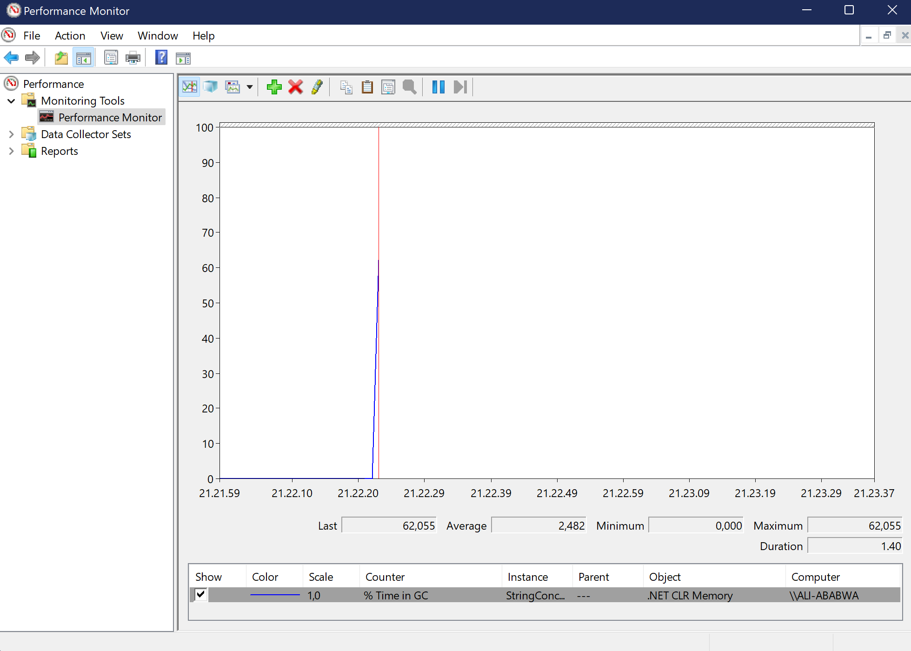
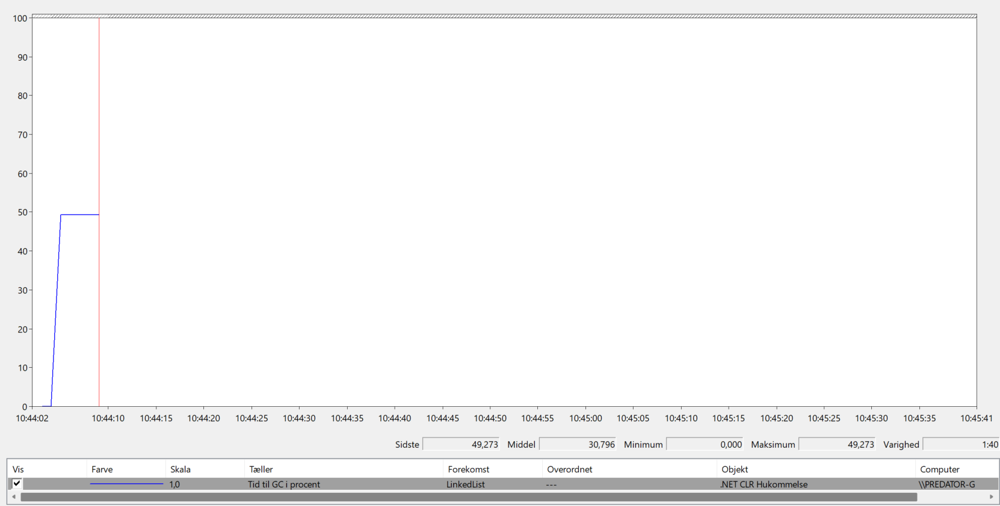

# Programs as Data - Assignment 8

Non-code answers to the exercises are answered in this document!

Assignments are from Programming Language Concepts (PLC), by Peter Sestoft, Springer 2017.

---

</br>

## PLC 9.1

Consider the following C# method from file `Selsort.cs`:

```csharp
public static void SelectionSort(int[] arr)
{
    for (int i = 0; i < arr.Length; i++)
    {
        int least = i;
        for (int j = i + 1; j < arr.Length; j++)
            if (arr[j] < arr[least])
                least = j;
        int tmp = arr[i];
        arr[i] = arr[least];
        arr[least] = tmp;
    }
}
```

(i) From a Visual Studio Command Prompt, compile it using Microsoft’s C# compiler with the optimize flag (`/o`), then disassemble it, saving the output to file `Selsort.il`

```txt
csc /o Selsort.cs
ildasm /text Selsort.exe > Selsort.il
```

Open `Selsort.il` in a text editor, find method `SelectionSort` and its body (bytecode), and delete everything else. Now try to understand the purpose of each bytecode instruction. Write comments to the right of the instructions (or between them) as you discover their purpose. Also describe which local variables in the bytecode (local 0, 1, …) correspond to which variables in the source code.

To see the precise description of a .NET Common Language Infrastructure bytecode instruction such as `ldc.i4.0`, consult the Ecma-335 standard [[10](https://www.ecma-international.org/publications-and-standards/standards/ecma-335/)], find Partition III (PDF pages 324-471 in the December 2010 version) of that document, and search for `ldc`.

> **Answer:** See files **9.1/Selsort.il** and **9.1/Selsort.exe**

(ii) Now do the same with the corresponding Java method in file `Selsort.java`. Compile it, then disassemble the Selsort class:

```txt
javac Selsort.java
javap -verbose -c Selsort > Selsort.jvmbytecode
```

Then investigate and comment `Selsort.jvmbytecode` as suggested above. For the precise description of JVM bytecode instructions, see [[17](https://docs.oracle.com/javase/specs/index.html), Chap. 6].

Hand in the two edited bytecode files with your comments.

> **Answer:** See files **9.1/Selsort.jvmbytecode** and **9.1/Selsort.class**

</br>

---

</br>

## PLC 9.2

This exercise investigates the garbage collection impact in Microsoft .NET of using repeated string concatenation to create a long string. This exercise also requires a Visual Studio Command Prompt.

(i) Compile the C# program `StringConcatSpeed.cs` and run it with `count` in the program set to 30,000:

```txt
csc /o StringConcatSpeed.cs
```

You will probably observe that the first computation (using a StringBuilder) is tremendously fast compared to the second one (repeated string concatenation), although they compute exactly the same result.
The reason is that the latter allocates a lot of temporary strings, each one slightly larger than the previous one, and copies all the characters from the old string to the new one.

> **Answer:** See output from test run of program **9.2/StringConcatSpeed.exe** below

```txt
.\StringConcatSpeed.exe
Initialization: Building array of small strings

Concatenate using StringBuilder:
Result length: 168894;    time:   0,000 sec


Press return to continue...


Concatenate using repeated string concatenation:
Result length: 168894;    time:   0,946 sec
```

(ii)  In this part, try to use the Windows Performance Monitor to observe the .NET garbage collector’s behavior when running StringConcatSpeed.

* In the Visual Studio Command Prompt, start `perfmon`.
* In the `perfmon` window, remove the default active performance counters (shown in the list below the display) by clicking the “X” button above the display three times.
* Start `StringConcatSpeed` and let it run till it says `Press return to continue....`
* In the `perfmon` window, add a new performance counter, like this:
  * press the "`+`" button above the display, and the "Add Counters" dialog pops up;
  * select Performance object to be "".NET CLR Memory";
  * select the counter "% Time in GC";
  * select instance to be "StringConcatSpeed" - note (***);
  * press the Add button;
  * close the dialog, and the "% Time in GC" counter should appear in the display
* Press return in the Visual Studio Command Prompt to let the StringConcatSpeed program continue. You should now observe that a considerable percentage of execution time (maybe 30–50 percent) is spent on garbage collection. For most well-written applications, this should be only 0–10 percent, so the high percentage is a sign that the program is written in a sick way.
* Hand in your quantitative observations together with a description of the platform (version of .NET etc).

> **Answer:**
>
> Microsoft Windows 11
>
> .NET version 6.0.203



(iii) Find another long-running C# program or application (you may well run it from within Visual Studio) and measure the time spent in garbage collection using the `perfmon` as above. Note: It is very important that you attach the performance counter to the particular process ("instance") that you want to measure, in the step marked (***) above, otherwise the results will be meaningless.

> **Answer:** See files **9.2/LinkedList.cs** and **9.2/LinkedList.exe**
>
> We have chosen to implement a class that adds and removes elements from a LinkedList of strings.
>
> Fib(1000000)



</br>

---
