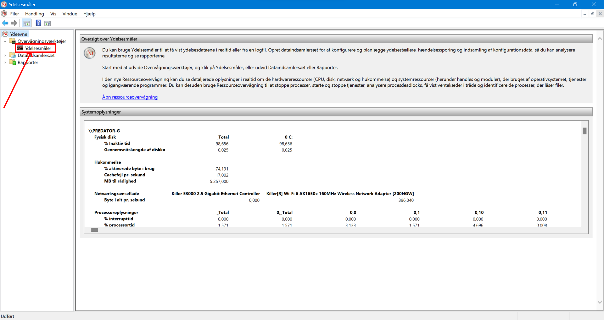
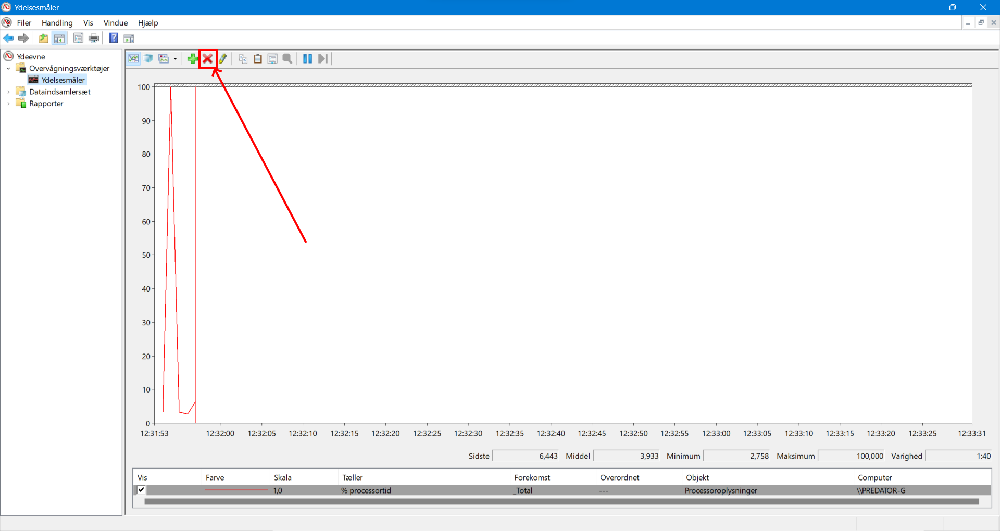
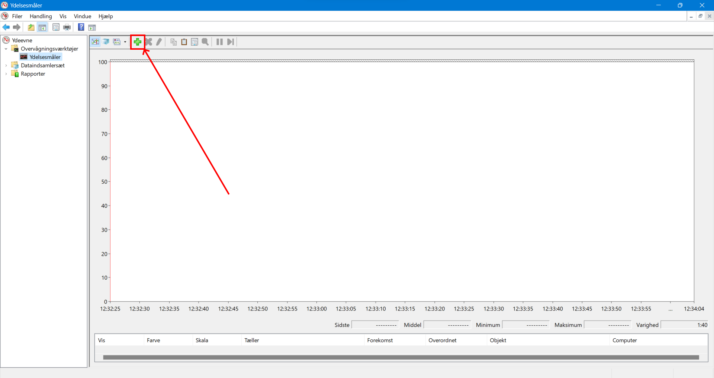
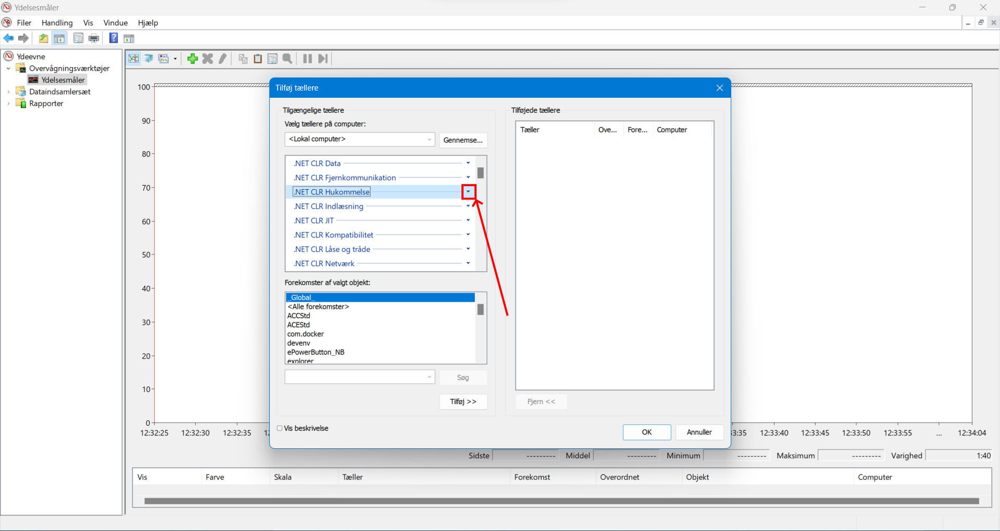
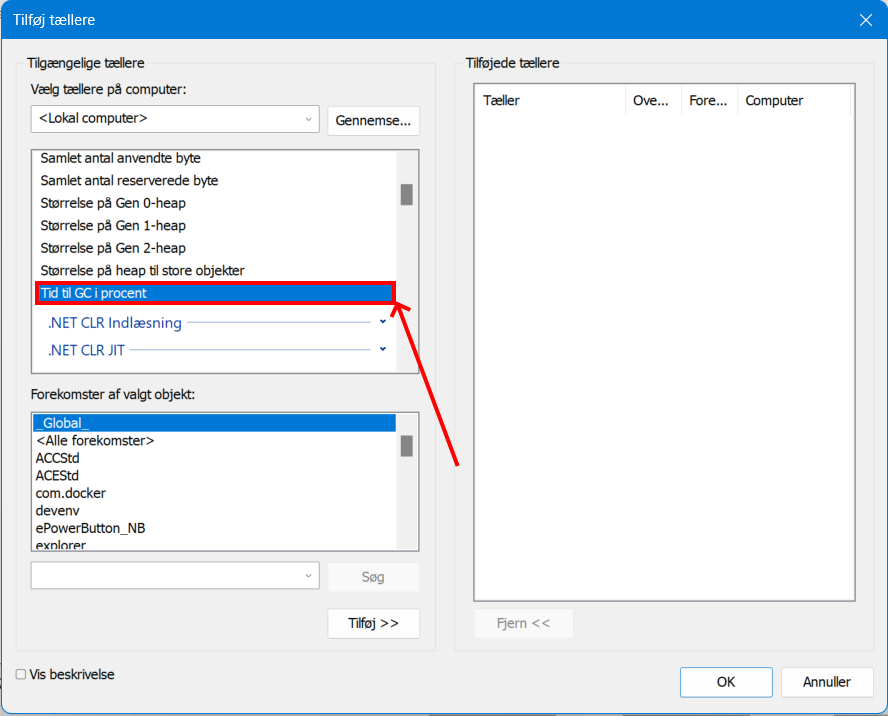
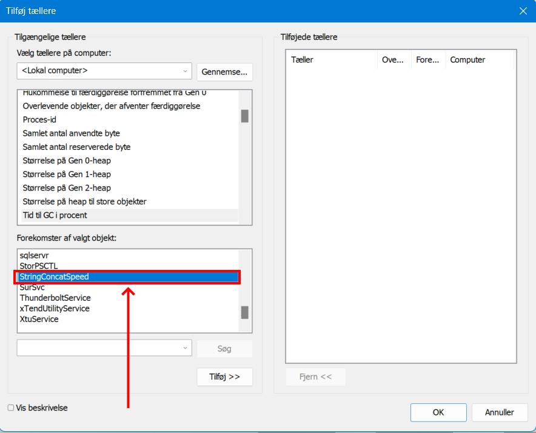
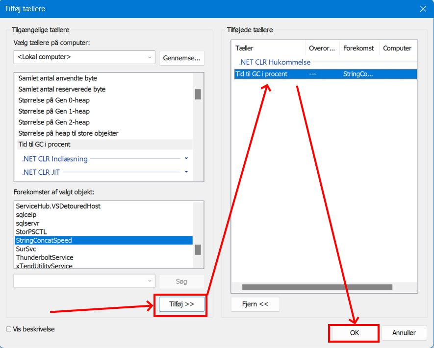
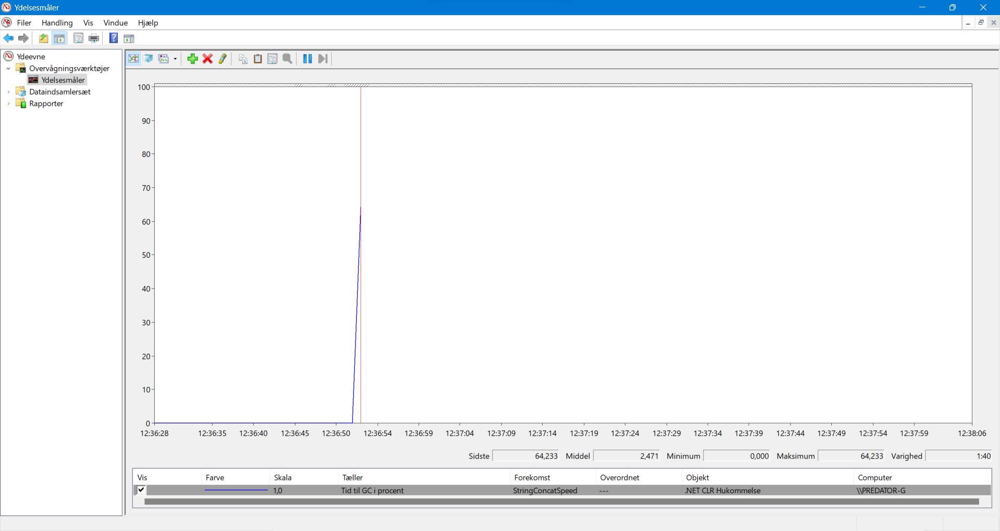

# Perfmon (Windows Performance Monitor) Guide

This is a guide on how to monitor .NET CLR garbage collection percent in Windows Performance Monitor (`perfmon`).

 

## How to open Perfmon

1. Start the program you want to monitor, e.g., `StringConcatSpeed.exe`
2. In a terminal or in Windows Start enter `perfmon` and press [ENTER]
3. You should now see the `perfmon` application.

 

---

 

## Setup Perfmon to track Percent Time in GC

1. Expand `Monitoring Tools` (Overvågningsværktøjer) and click on `Performance Monitor` (Ydelsesmåler)

2. Click on the red cross to remove all monitored process.

3. Click on the green cross to add a new process to be monitored.

4. Click the expansion arrow under `.NET CLR Memory` (.NET CLR Hukommelse)

5. In the list find "`% Time in GC`" ("Tid til GC i procent") and select it.

6. In the instance selector, find `StringConcatSpeed` and select it.

7. Click the add button, and then the OK button.

8. `StringConcatSpeed` will now be monitored by the selected counter.

 

---
